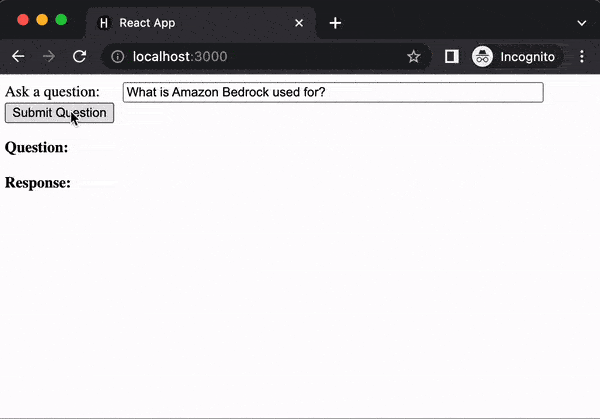

# Serverless RAG with Lambda, S3, and LanceDB - Testing

This data ingestion pipeline allows you to create embeddings from your PDF 
documents and make them available to LanceDB in your Lambda function.

## Prerequisites

As you'll be running this locally, make sure your `aws cli` is configured with
permissions to PUT files on S3 and invoke models on Amazon Bedrock.

## Usage

### No Authentication
```bash
cd testing
chmod u+x test-no-auth.sh # ensure you can execute the file
./test-no-auth.sh <your-stack-name> # find it in ./samconfig.toml
```

### With IAM Authentication
You will need to ensure you have your AWS credentials as environment variables in order for this script to work.
```bash
# AWS_ACCESS_KEY_ID
# AWS_SECRET_ACCESS_KEY
# AWS_SESSION_TOKEN
# AWS_REGION
cd testing
chmod u+x test-with-auth.sh # ensure you can execute the file
./test-with-auth.sh <your-stack-name> # find it in ./samconfig.toml
```

### Sample Output
```bash
 Based on the context provided, Amazon Bedrock is a fully managed service that makes base models from Amazon and third-party model providers accessible through an API. Some key points about Amazon Bedrock:

- It allows users to access and explore various AI/ML models from Amazon and other providers through APIs, text/image/chat playgrounds in the AWS Management Console, and examples. 

- It supports models from providers like Amazon, Anthropic, Cohere, Stability.ai, etc. for tasks like text generation, image generation, conversations. 

- It provides capabilities like text/image/chat playgrounds, examples library, API access, embeddings generation, provisioned throughput for discounted inference pricing, fine-tuning of models, and model invocation logging. 

- It is available in various AWS regions and users are charged only for the specific services/models they use based on volume of input/output tokens and provisioned throughput purchases.

So in summary, Amazon Bedrock is a managed service that provides unified access and capabilities for various AI/ML models from different providers through its APIs and console for users to explore and utilize for their applications and use cases.
```

## Implementing within a React.js application
If you wish to invoke this function URL within a React application, you will need to use a request library that supports streaming.
Inside the [React](./react) folder, you can see a simple example using the MIT licensed [@microsoft/fetch-event-source](https://www.npmjs.com/package/@microsoft/fetch-event-source) package and also using AWS IAM auth.

### Usage
You will need to ensure you have your AWS credentials as environment variables in order for this script to work.

```bash
# AWS_ACCESS_KEY_ID
# AWS_SECRET_ACCESS_KEY
# AWS_SESSION_TOKEN
# AWS_REGION
export STACK_NAME=<your-stack-name>  # find it in ./samconfig.toml
export LAMBDA_ENDPOINT_URL=$(aws cloudformation describe-stacks --stack-name $STACK_NAME --query 'Stacks[0].Outputs[?OutputKey==`StreamingRAGFunctionURL`].OutputValue' --output text)

cd testing/react
npm install
npm run start
# A UI will open at localhost:3000 that you can then ask questions to.
```

